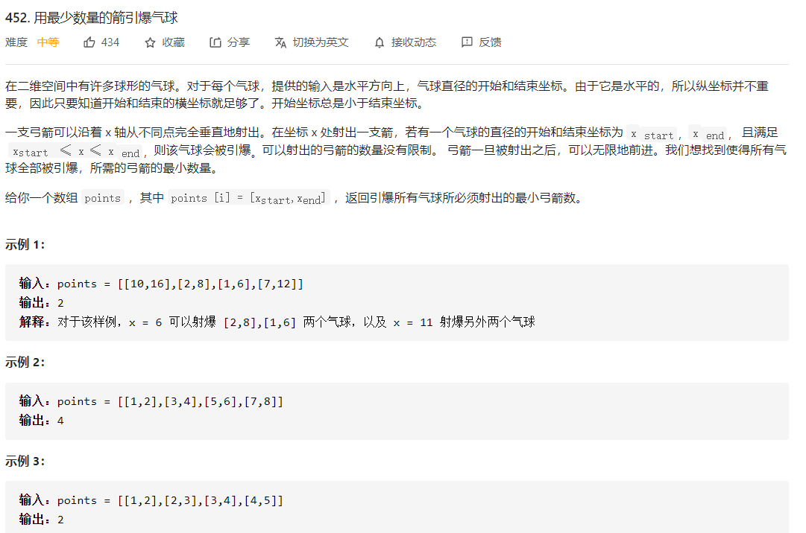
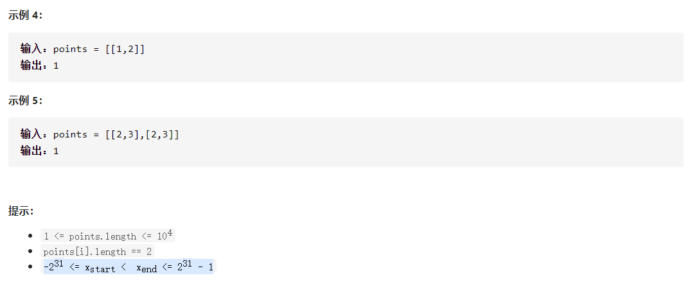

# [452. 用最少数量的箭引爆气球](https://leetcode-cn.com/problems/minimum-number-of-arrows-to-burst-balloons/)






## 题解

LeetCode题解链接：https://leetcode-cn.com/problems/minimum-number-of-arrows-to-burst-balloons/solution/c-an-startpai-xu-by-oyzg/

首先看到这题，自然会想到排序
所以先**自定义排序**
在其他题解中，有的是按end排序的，这里我是按start排序的

```c++
static bool myCompare(const vector<int>& a,const vector<int>& b) {
        return a[0]<b[0];
    }
```

自定义排序之后遍历数组
对于从i开始的一支箭，用x记录它的位置
如果`points[j][0] > x,` break,退出循环, `count++;`
否则，更新x，因为`points[j][1]`可能会比x小，所以将x更新为`min(x,points[j][1]);`

完整代码：

```c++
class Solution {
public:
    static bool myCompare(const vector<int>& a,const vector<int>& b) {
        return a[0]<b[0];
    }
    int findMinArrowShots(vector<vector<int>>& points) {
        if(points.size() == 0) return 0;
        if(points.size() == 1) return 1;
        sort(points.begin(),points.end(),myCompare);
        int count = 0;
        for(int i = 0; i < points.size(); i++) {
            int x = points[i][1];
            for(int j = i+1; j < points.size(); j++) {
                
                if(points[j][0] > x) {
                    break;
                }
                i++;
                x = min(x,points[j][1]);
                
            }
            count++;
        }
        return count;
    }
};
```

