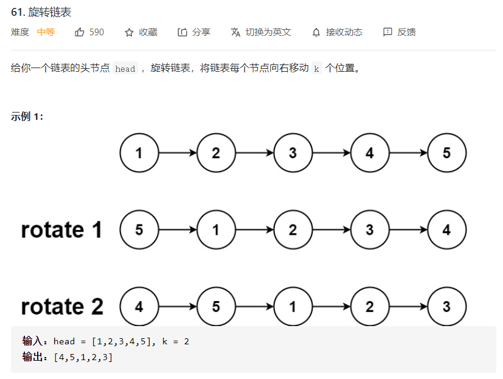
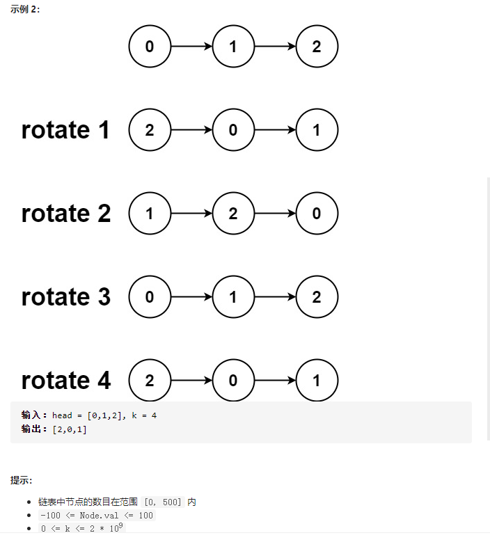

# [61. 旋转链表](https://leetcode-cn.com/problems/rotate-list/)






## 题解

61.旋转链表
思路：

1. 旋转链表 即 断开新的头结点前的连接 将现在的尾结点与头结点连接起来
2. 首先，遍历链表，求出链表长度size，同时记录尾结点；
3. 因为k可能大于size, 所以对k取余，k %= size;
4. 找到旋转后的新的头结点的前一个节点, 即 第size-k-1位的节点
5. 断开该节点与新的头结点的连接，并记录新的头节点
6. 将记录的尾结点tail与之前的头结点head连接起来

作者：oyzg
链接：https://leetcode-cn.com/problems/rotate-list/solution/java-zhong-xin-cheng-lian-by-oyzg-45un/

```java
/**
 * Definition for singly-linked list.
 * public class ListNode {
 *     int val;
 *     ListNode next;
 *     ListNode() {}
 *     ListNode(int val) { this.val = val; }
 *     ListNode(int val, ListNode next) { this.val = val; this.next = next; }
 * }
 */
class Solution {
    public ListNode rotateRight(ListNode head, int k) {
		if(head == null) return head;
		//求size；
        int size = 1;
		ListNode cur = head;
		while(cur.next != null) {
			cur = cur.next;
			size++;
		}
		//注意对k取余
        k %= size;
        if(size <= 1 || k == 0) return head;
		//原来的尾结点
        ListNode tail = cur;
		cur = head;
		for(int i = 0; i < size-k-1; i++) {
			cur = cur.next;
		}
		//新的头节点
		ListNode res = cur.next;
		//断开新的头节点与前一位节点的连接
		cur.next = null;
		//将原来的尾结点与原来的头节点连接起来
        tail.next = head;
		return res;
    }
}
```

